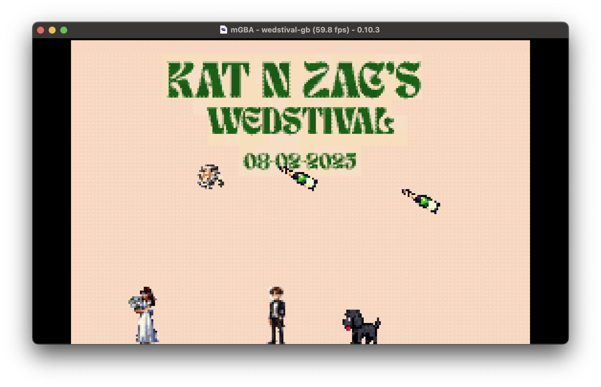

# Wedding Game (Gameboy Advance)

This is a game I made for my wedding. It's a simple gameboy advance game where you play as me and have to collect all the bouquets to win the game. The game is written in C and compiled with devkitPro.

## Requirements

* Visual Studio Code
* Docker

## Building

* Open the project in Visual Studio Code as a Dev Container.
* Run `make` in the terminal to build the game.
* The game will be built as `wedstival-gba.gba`.
